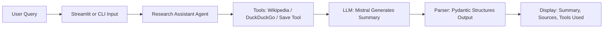

# 🧠 AI Research Assistant

## Overview
The **AI Research Assistant** leverages **Mistral LLM** and **LangChain** to generate structured research summaries. It retrieves relevant sources, logs tools used, and presents outputs in a clean format. Users can interact via:

- **Command-Line Interface (CLI)** for quick research.
- **Streamlit Web App** for an interactive experience.

---

## Problem Statement
Manual research is time-consuming and error-prone. Gathering, summarizing, and citing information across multiple sources can take hours. The Research Assistant automates this process, saving time and improving research quality.

---

## Methods & Tools
- **Language Model:** Mistral LLM for natural language understanding and generation.
- **Framework:** LangChain to manage prompts, tools, and structured outputs.
- **Tools Integrated:**
  - **DuckDuckGo Search** – Online query tool.
  - **Wikipedia** – Encyclopedic reference.
  - **Custom Save Tool** – Optional logging of results.
- **Frontend:** Streamlit for interactive queries and display.
- **Output Parsing:** Pydantic ensures structured responses.
- **Error Handling:** Graceful handling of API rate limits (HTTP 429) and unexpected errors.

---

## Workflow Diagram


*Diagram illustrates the flow from user query to structured output.*

---

## Usage

### 1️⃣ Command-Line Interface
Run the agent directly:

```bash
python main.py
```

- Enter your research query.
- The agent returns a structured summary, sources, and tools used.

### 2️⃣ Streamlit Web App
Run the interactive frontend:

```bash
streamlit run app.py
```

- Type your research question.
- Click **Search** to generate structured results.

---


## Saving Research Output

The agent can optionally save research summaries to a file called `research_output.txt` for future reference.

- **Content:** Each entry includes the query/topic, summary, sources, and tools used.  
- **Usage:** When the agent is configured to save, it appends results to `research_output.txt` automatically.
- **Example Entry:**
```
--- Research Output ---
Timestamp: 2025-m-02 13:28:36

{
  "topic": "LangChain in Creating AI Agents",
  "summary": "LangChain is an emerging framework in the field of artificial intelligence that facilitates the creation of sophisticated AI agents. It provides a robust platform for developers and AI enthusiasts to build adaptive and complex AI applications. LangChain integrates various components such as language models, memory systems, and tooling interfaces, enabling the development of self-sustaining AI agents.\n\nOne of the key features of LangChain is its ability to combine large language models (LLMs) with external data sources and computational tools. This integration allows AI agents to perform tasks such as reasoning, decision-making, and interacting with users in a more dynamic and context-aware manner.\n\nThe LangChain Agent UI, powered by frameworks like CoAgent, offers a user-friendly interface for building and deploying AI agents. This makes it accessible for both developers and non-technical users to create AI-driven solutions tailored to specific needs.\n\nLangChain is particularly valuable for enterprises looking to implement AI agents for tasks like customer support, automation, and data analysis. Its modular design and flexibility make it a powerful toolset for innovating in the AI space.\n\nOverall, LangChain represents a significant advancement in the development of AI agents, providing the tools and frameworks necessary to create intelligent, autonomous systems capable of operating in real-world environments.",
  "sources": [
    "https://en.wikipedia.org/wiki/Intelligent_agent",
    "https://www.aitidbits.com",
    "https://dev.to/langchain"
  ],
  "tools_used": ["Wikipedia", "Web Search"]
}
```

---

## Results & Key Takeaways
**Example Output:**
```
Summary: "Artificial Intelligence (AI) is a field of computer science focused on building intelligent machines..."
Sources:
- https://en.wikipedia.org/wiki/Artificial_intelligence
- https://www.example.com/ai-research
Tools Used: wikipedia, search_tool
```

**Key Takeaways:**
- Automates research tasks and accelerates information retrieval.
- Provides structured, easy-to-read results.
- Reduces time and effort in gathering credible sources.
- Works seamlessly in both CLI and Streamlit interfaces.
- Handles API limits and unexpected errors gracefully.

---

## Project Structure
```
research-assistant/
├── main.py          # Core agent logic
├── app.py           # Streamlit frontend
├── tools.py         # Tool definitions (search, wiki, save)
├── pyproject.toml   # Project configuration
├── research_output.txt   # Saving Research Output
├── README.md        # This file
└── .env             # Environment variables (API keys)
```

---

## Installation

1. Clone the repository:
```bash
git clone <your-repo-url>
cd research-assistant
```

2. **Install dependencies using UV:**

```bash
uv install
```

3. **Run the agent:**

- **CLI:**
```bash
uv run main.py
```

- **Streamlit Web App:**
```bash
streamlit run app.py
```
